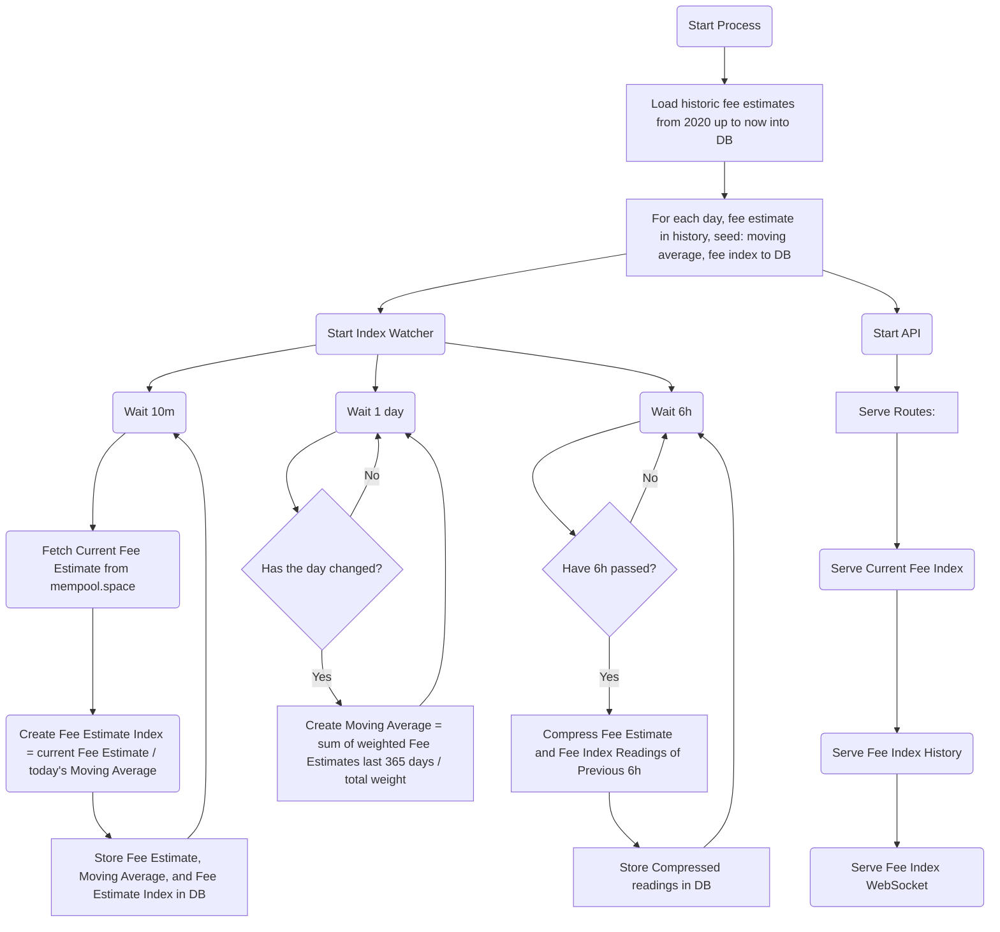

## BTC Fee Watcher: Index schedule & math used

### Watcher Process:

### Statistical details:

For more details on the exact math used to compute the values used for the fee index, refer:
https://colab.research.google.com/drive/1Fsn03dJQw3Agyii14YEic99WgKHzB_a-?usp=sharing

