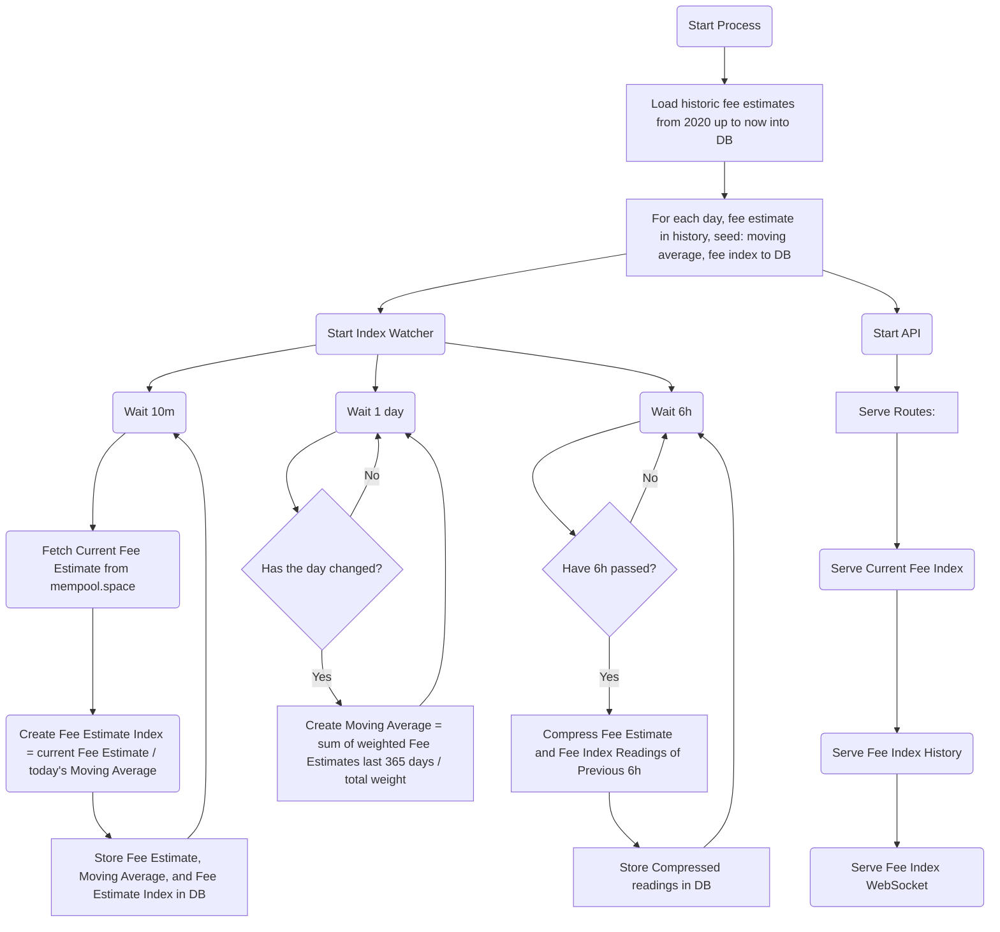

## Explanation of the math used: 

### Watcher Process:

### Moving Average formula:

    async create(day: Date): Promise<boolean | Error> {
    try {
      const calculateWeightedAverage = (
        feeHistory: Array<{ id: number; time: Date; satsPerByte: Decimal }>,
      ) => {
        let weightedSum = 0;
        let totalWeight = 0;

        for (let i = 0; i < feeHistory.length - 1; i++) {
          const stepSizeHours =
            (feeHistory[i + 1].time.getTime() - feeHistory[i].time.getTime()) /
            (1000 * 60 * 60); // Difference in hours
          const weight = stepSizeHours; // Directly using step size in hours as weight
          weightedSum += feeHistory[i].satsPerByte.toNumber() * weight;
          totalWeight += weight;
        }

        // Handle last reading separately (assuming average of total weight as the penultimate step or default to 1 if only one reading)
        const lastWeight = totalWeight > 0
          ? totalWeight / (feeHistory.length - 1)
          : 1;
        weightedSum +=
          feeHistory[feeHistory.length - 1].satsPerByte.toNumber() * lastWeight;
        totalWeight += lastWeight;

        const weightedMovingAverage = new Decimal(weightedSum / totalWeight);
        return weightedMovingAverage;
      };

      const feeHistoryLast365Days = await this.feeOp.readLast365Days(day);

      if (feeHistoryLast365Days instanceof Error) {
        return feeHistoryLast365Days;
      }
      if (feeHistoryLast365Days.length === 0) {
        throw new Error("Array is empty, cannot calculate average.");
      }
      const averageLast365Days = calculateWeightedAverage(
        feeHistoryLast365Days,
      );

      const feeHistoryLast30Days = await this.feeOp.readLast30Days(day);
      if (feeHistoryLast30Days instanceof Error) {
        return feeHistoryLast30Days;
      }
      if (feeHistoryLast30Days.length === 0) {
        throw new Error("Array is empty, cannot calculate average.");
      }
      const averageLast30Days = calculateWeightedAverage(feeHistoryLast30Days);

      const update: MovingAverages = {
        id: null, // Added by DB
        day: day,
        createdAt: null, //Added by DB,
        last365Days: averageLast365Days,
        last30Days: averageLast30Days,
      };

      this.store.insert(update);
      return true;
    } catch (e) {
      return handleError(e);
    }
  }

### Fee Index formula: 

     async create(feeEstimate: FeeEstimates): Promise<boolean | Error> {
      try {
        const movingAverage = await this.movingAvgStore.readByDay(
          feeEstimate.time,
        );

      if (!movingAverage) {
        console.error(`No moving averge for fee est: ${feeEstimate.time}`);
        return true;
      }

      if (
        !(movingAverage instanceof Error) &&
        movingAverage
      ) {
        const ratioLast365Days = feeEstimate.satsPerByte.toNumber() /
          movingAverage.last365Days.toNumber();

        const ratioLast30Days = feeEstimate.satsPerByte.toNumber() /
          movingAverage.last30Days.toNumber();

        const index: FeeIndexes = {
          id: null, //added by DB
          time: feeEstimate.time,
          feeEstimateId: feeEstimate.id,
          movingAverageId: movingAverage.id,
          ratioLast365Days: new Decimal(ratioLast365Days),
          ratioLast30Days: new Decimal(ratioLast30Days),
          createdAt: null, //added by DB
        };

        const res = await this.store.insert(index);
        if (res instanceof Error) {
          console.error(`Error inserting fee index: ${res}`);
          const feeEstId = feeEstimate.id;
          throw res;
        }
      }
      return true;
    } catch (e) {
      return handleError(e);
    }
    }

